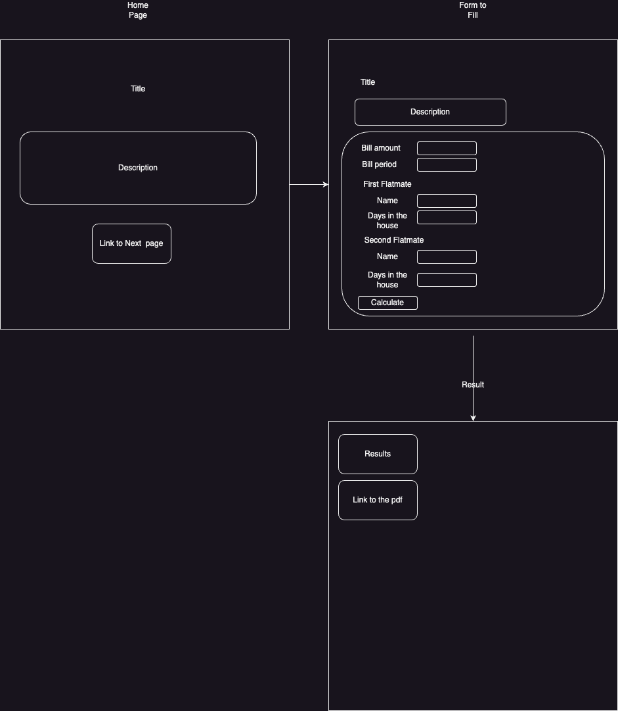
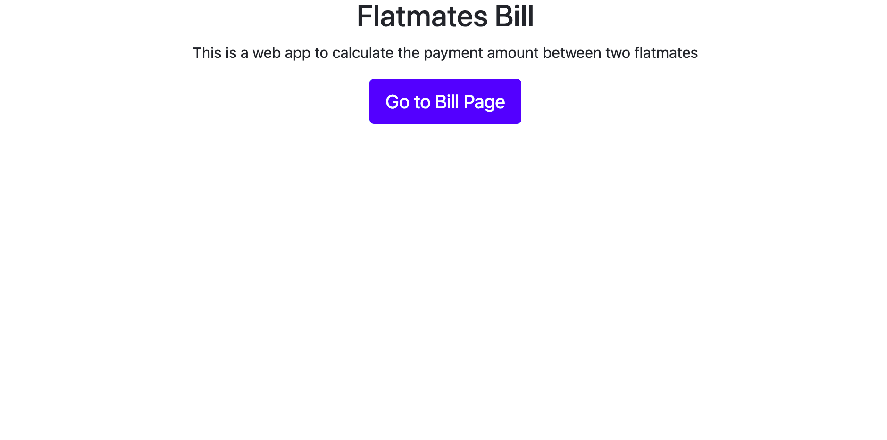
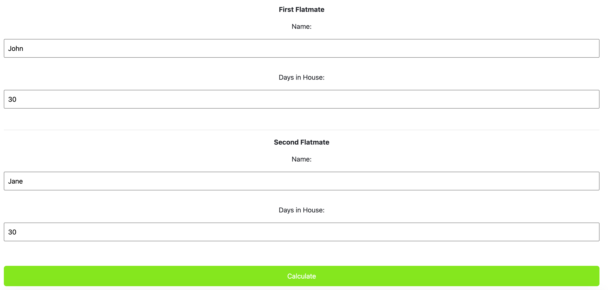
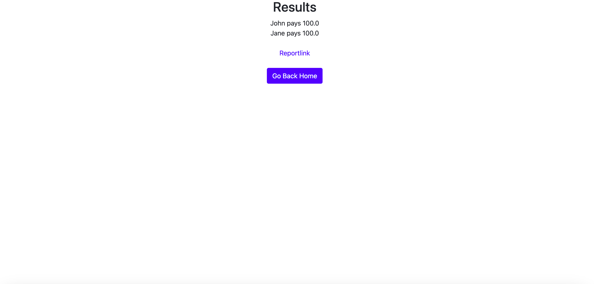

## Title: Flatmates Bill
Description: An app that gets as input the amount of a bill for a particular period
and the     days that each of the flatmates stayed in the house for that period
and returns how much each flatmate has to pay. It also generates a PDF report
stating the names of the flatmates, the period, and how much each of them had to pay.
### Design in OOP 
        Bill:
            amount
            period

         Flatmate:
            name
            days_in_house
            pays(bill)

         PdfReport:
            filename
            generate(flatmate1, flatmate2, bill)

### Design of the web ui

